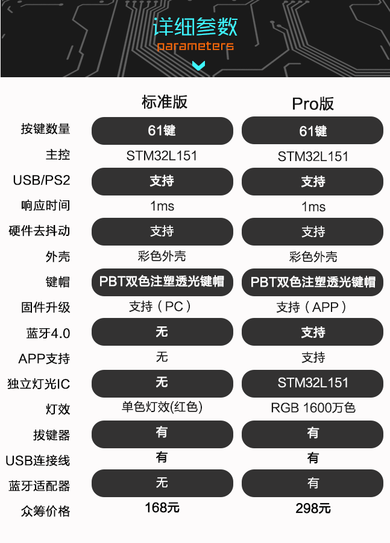

# 安妮机械键盘

[官方网站][anne-link] | [京东众筹][anne-jd-z-link] | [淘宝店铺][anne-taobao-link]

> 安妮键盘是由 obins 是由一群程序猿、设计师和外设发烧友一同打造的外设品牌。
> o是our的首字母，代表着程序猿、设计师、发烧友、粉丝等喜欢obins产品的所有生物体，
> bin 在计算机中表示程序本身，在物理世界中代表我们的产品，obins 就是大家共同创造的产品，
> 希望用最用心的设计，为用户提供最完美的产品和体验。

## 声明

这是一份非官方收集的关于安妮机械键盘的相关资料，主要目的是为了方便使用者能够找到一个相对比较全的地方查阅资料。

## 版本

- 安妮
- 安妮 Pro

### 详细参数和区别

这是一款 60% 键机械键盘

> TODO

## 快捷键

快捷键 | 描述 | 备注
---|---|---
FN + U | 切换灯效（单循环） | 先静态在动态
FN + Y | 调整灯光亮度（单循环） | 10 级亮度
FN + B | 蓝牙适配 | 详情看[PDF][anne-manaul-link]

## 按键布局（配列）

### 标准布局1

> 系统预置布局

快捷键 | 描述
---|---
FN + WSAD | 上下左右
FN + IKJL | 上下左右
FN + ? | Delete
FN + > | Insert
FN + ; | Page Up
FN + ' | Page Down
FN + [ | Home
FN + ] | End
FN + \ | Print Screen
FN + 123456789 | 功能键 F1-9
FN + 0 | 功能键 F10
FN + - | 功能键 F11
FN + = | 功能键 F12

### 标准布局2

> 带独立方向键的标准布局

### Mac 布局

## 固件版本

- `正式版` 版本号以偶数结尾的
- `测试版` 版本号以奇数结尾的

### [升级固件说明书][anne-dfu-manaul-link]

[anne-link]: http://www.obins.net/
[anne-jd-z-link]: http://z.jd.com/project/details/34676.html
[anne-taobao-link]: https://shop116784704.taobao.com/

[anne-manaul-link]: files/安妮PRO使用须知1.pdf
[anne-dfu-manaul-link]: files/固件升级简易说明书.png