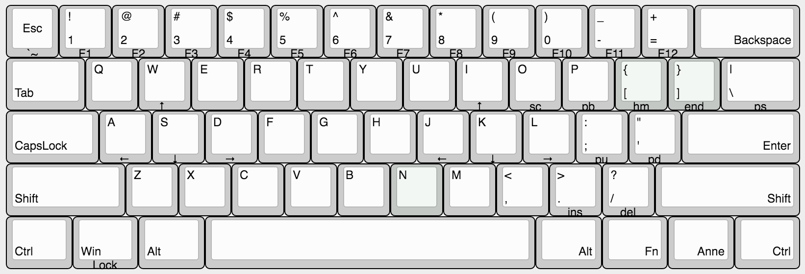
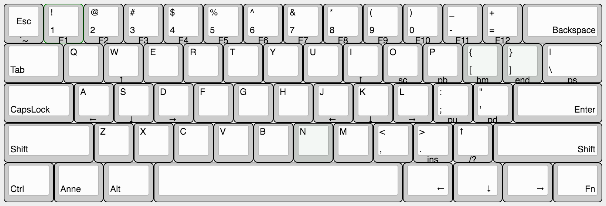
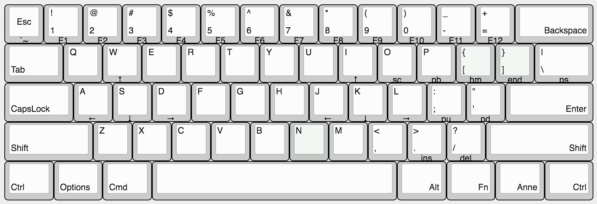

# 安妮机械键盘

[官方网站][anne-link] | [京东众筹][anne-jd-z-link] | [淘宝店铺][anne-taobao-link]

> 安妮键盘是由 obins 是由一群程序猿、设计师和外设发烧友一同打造的外设品牌。
> o是our的首字母，代表着程序猿、设计师、发烧友、粉丝等喜欢obins产品的所有生物体，
> bin 在计算机中表示程序本身，在物理世界中代表我们的产品，obins 就是大家共同创造的产品，
> 希望用最用心的设计，为用户提供最完美的产品和体验。

## 声明

这是一份非官方收集的关于安妮机械键盘的相关资料，主要目的是为了方便使用者能够找到一个相对比较全的地方查阅资料。

## 沟通交流

- 键盘群 `478061089`
- 固件群 `340574284` - 需校验键盘群是否已加

## 版本

- 安妮标准版
- 安妮 Pro 版

### 详细参数和区别

这是一款 60% 键机械键盘

名称 | 标准版 | Pro 版
---|---|---
按键数量 | 61 | 61
主控 | STM32L151 | STM32L151
USB/PS2 | 支持 | 支持
响应时间 | 1ms | 1ms
硬件去抖动 | 支持 | 支持
外壳 | 彩色外壳 | 彩色外壳
键帽 | PBT 双色注塑透光 | PBT 双色注塑透光
固件升级 | 支持(PC) | 支持(App)
蓝牙4.0 |  无 | **支持**
App支持 | 无 | **支持**
独立灯光IC | 无 | **支持**
灯效 | 单色灯效(红) | **RGB 1600万色**
拔键器 | 有 | 有
USB连接线 | 有 | 有
蓝牙适配器 | 无 | **有**

## 默认快捷键

快捷键 | 描述 | 备注 | 版本要求
---|---|---|---
FN + W/I | ↑
FN + A/J | ←
FN + S/K | ↓
FN + D/L | →
FN + O | Scroll Lock
FN + P | Pause Break
FN + \| | Print Screen
FN + :; | Page Up
FN + '" | Page Down
FN + .> | Insert
FN + /? | Delete
FN + [{ | Home
FN + ]} | Eed
FN + 1~9 | F1~F9
FN + 0 | F10
FN + - | F11
FN + + | F12
FN + U | 切换灯效（单循环） | 4 级调整 先静态再动态 | 
FN + Y | 调整灯光亮度（单循环） | 10 级亮度
FN + T | 动态灯效速率||
FN + B | 蓝牙适配 | 详情看[如下说明](#bluetooch)或[PDF][anne-manaul-link]
FN + - | 关闭蓝牙 | | v1.0a+
FN + R | 一键关灯 | | v1.0a+
FN + 0 | 兼容模式/标准模式切换 | 必须在蓝牙配置模式下操作 黄灯表示兼容模式，绿灯为标模式 | v1.0a+
Fn + Win | WinLocak || 1.20.00+
Left_Ctrl + Right_Ctrl | 切换配列(Layout) || 1.40.00+
Left_Alt + Right_Alt | 锁定 Fn 层 | | 1.40.00+

## 蓝牙适配

安妮Pro的蓝牙设置需要 Fn + B 先进入蓝牙配置模式，然后进行设置，完成后按 ESC 退出

快捷键 | 描述 
---|---
Fn + B | 进入蓝牙配置模式
ESC | 退出蓝牙适配模式

### 开启、关闭蓝牙

安妮Pro可以独立开启和关闭蓝牙，操作流程如下：

#### 打开蓝牙广播

1. `Fn+B`:  进入蓝牙配置模式
2. `+`:  开启蓝牙广播，+ 号按键会开始闪烁
3. `Esc`:  退出蓝牙配置模式

#### 关闭蓝牙

1. `Fn+B`:  进入蓝牙配置模式
2. `-`:  关闭蓝牙，并没有特殊灯光指示
3. `Esc`:  退出蓝牙配置模式

#### 保存连接的主机

安妮Pro可以保存4台主机，方便快速连接，在蓝牙配置模式下，操作流程如下：

1. `Fn+B`: 进入蓝牙配置模式
2. `Fn+1`: 保存当前连接至1号位
3. `Esc`:  退出蓝牙配置模式

#### 切换连接的主机

快速连接到已经保存的主设备，安妮Pro可以保存4台主设备，在蓝牙配置模式下按 1、2、3、4 可以主动连接到指定设备、进行主机切换。比如切换到 1 号主机操作流程如下：

1. `Fn+B`:  进入蓝牙配置模式
2. `1`:  切换到1号位主设备，1号按键会闪烁，配对完成后停止闪烁
3. `Esc`:  退出蓝牙配置模式

### 兼容模式（L0\L1模式切换）

L1模式是特别针对Win7的兼容模式，Win7默认并不支持蓝牙4.0，所以Win7系统需要把键盘配置成 L1模式才能连接：

#### L0/L1模式切换

1. `Fn+B`:  进入蓝牙配置模式
2. `Fn+0`:  进行L0/L1模式切换
3. `Esc`:  退出蓝牙配置模式

**Note 1**：

L0模式 :   按键 0 绿灯亮，超低功耗是模式
L1模式 :   按键 0 黄灯亮，功耗较高，兼容Win7

**Note 2**：

部分蓝牙芯片在win7模式下通过安装驱动可以直接支持BLE、安妮L0模式，如Intel的部分蓝牙模组

## 按键布局（配列）

### 标准布局1

> 系统预置布局

[][anne-standard-layout1-link]

### 标准布局2

> 带独立方向键的标准布局

[][anne-standard-layout2-link]

### Mac 布局

> Mac 标准布局

[][anne-mac-layout-link]

## 固件版本

- `正式版` 版本号以偶数结尾的
- `测试版` 版本号以奇数结尾的

### [升级固件说明书][anne-dfu-manaul-link]

### 版本列表

版本[变更历史][anne-dfu-changelog-link]

[anne-link]: http://www.obins.net/
[anne-jd-z-link]: http://z.jd.com/project/details/34676.html
[anne-taobao-link]: https://shop116784704.taobao.com/

[anne-standard-layout1-link]:  http://www.keyboard-layout-editor.com/##@_name=%E5%AE%89%E5%A6%AE%E6%A0%87%E5%87%86%E5%B8%83%E5%B1%801%3B&@_a:7%3B&=Esc%0A%0A%0A%0A%60~&_a:4%3B&=!%0A1%0A%0A%0AF1&=%2F@%0A2%0A%0A%0AF2&=%23%0A3%0A%0A%0AF3&=$%0A4%0A%0A%0AF4&=%25%0A5%0A%0A%0AF5&=%5E%0A6%0A%0A%0AF6&=%2F&%0A7%0A%0A%0AF7&=*%0A8%0A%0A%0AF8&=(%0A9%0A%0A%0AF9&=)%0A0%0A%0A%0AF10&=%2F_%0A-%0A%0A%0AF11&=+%0A%2F=%0A%0A%0AF12&_w:2%3B&=%0A%0A%0ABackspace%3B&@_w:1.5%3B&=%0ATab&=Q&=W%0A%0A%0A%0A%3Ci%20class%2F='kb%20kb-Arrows-Up'%3E%3C%2F%2Fi%3E&=E&=R&=T&=Y&=U&=I%0A%0A%0A%0A%3Ci%20class%2F='kb%20kb-Arrows-Up'%3E%3C%2F%2Fi%3E&=O%0A%0A%0A%0Asc&=P%0A%0A%0A%0Apb&_c=%23c4c8c5%3B&=%7B%0A%5B%0A%0A%0Ahm&=%7D%0A%5D%0A%0A%0Aend&_c=%23cccccc&w:1.5%3B&=%7C%0A%5C%0A%0A%0Aps%3B&@_w:1.75%3B&=%0ACapsLock&=A%0A%0A%0A%0A%3Ci%20class%2F='kb%20kb-Arrows-Left'%3E%3C%2F%2Fi%3E&=S%0A%0A%0A%0A%3Ci%20class%2F='kb%20kb-Arrows-Down'%3E%3C%2F%2Fi%3E&=D%0A%0A%0A%0A%3Ci%20class%2F='kb%20kb-Arrows-Right'%3E%3C%2F%2Fi%3E&=F&=G&=H&=J%0A%0A%0A%0A%3Ci%20class%2F='kb%20kb-Arrows-Left'%3E%3C%2F%2Fi%3E&=K%0A%0A%0A%0A%3Ci%20class%2F='kb%20kb-Arrows-Down'%3E%3C%2F%2Fi%3E&=L%0A%0A%0A%0A%3Ci%20class%2F='kb%20kb-Arrows-Right'%3E%3C%2F%2Fi%3E&=%2F:%0A%2F%3B%0A%0A%0Apu&=%22%0A'%0A%0A%0Apd&_st=MX3A-L1xx&w:2.25%3B&=%0A%0A%0AEnter%3B&@_w:2.25%3B&=%0AShift&=Z&=X&=C&=V&=B&_c=%23c4c8c5%3B&=N&_c=%23cccccc%3B&=M&=%3C%0A,&=%3E%0A.%0A%0A%0Ains&=%3F%0A%2F%2F%0A%0A%0Adel&_w:2.75%3B&=%0A%0A%0AShift%3B&@_w:1.25%3B&=%0ACtrl&_w:1.25%3B&=%0AWin%0A%0A%0ALock&_w:1.25%3B&=%0AAlt&_a:7&w:6.25%3B&=&_a:4&w:1.25%3B&=%0A%0A%0AAlt&_w:1.25%3B&=%0A%0A%0AFn&_w:1.25%3B&=%0A%0A%0AAnne&_w:1.25%3B&=%0A%0A%0ACtrl
[anne-standard-layout2-link]: http://www.keyboard-layout-editor.com/##@_name=%E5%AE%89%E5%A6%AE%E6%A0%87%E5%87%86%E5%B8%83%E5%B1%802%20-%20%E9%94%AE%E7%9B%98%E5%B8%A6%E7%8B%AC%E7%AB%8B%E6%96%B9%E5%90%91%E9%94%AE%3B&@_a:7%3B&=Esc%0A%0A%0A%0A%60~&_a:4%3B&=!%0A1%0A%0A%0AF1&=%2F@%0A2%0A%0A%0AF2&=%23%0A3%0A%0A%0AF3&=$%0A4%0A%0A%0AF4&=%25%0A5%0A%0A%0AF5&=%5E%0A6%0A%0A%0AF6&=%2F&%0A7%0A%0A%0AF7&=*%0A8%0A%0A%0AF8&=(%0A9%0A%0A%0AF9&=)%0A0%0A%0A%0AF10&=%2F_%0A-%0A%0A%0AF11&=+%0A%2F=%0A%0A%0AF12&_w:2%3B&=%0A%0A%0ABackspace%3B&@_w:1.5%3B&=%0ATab&=Q&=W%0A%0A%0A%0A%3Ci%20class%2F='kb%20kb-Arrows-Up'%3E%3C%2F%2Fi%3E&=E&=R&=T&=Y&=U&=I%0A%0A%0A%0A%3Ci%20class%2F='kb%20kb-Arrows-Up'%3E%3C%2F%2Fi%3E&=O%0A%0A%0A%0Asc&=P%0A%0A%0A%0Apb&_c=%23c4c8c5%3B&=%7B%0A%5B%0A%0A%0Ahm&=%7D%0A%5D%0A%0A%0Aend&_c=%23cccccc&w:1.5%3B&=%7C%0A%5C%0A%0A%0Aps%3B&@_w:1.75%3B&=%0ACapsLock&=A%0A%0A%0A%0A%3Ci%20class%2F='kb%20kb-Arrows-Left'%3E%3C%2F%2Fi%3E&=S%0A%0A%0A%0A%3Ci%20class%2F='kb%20kb-Arrows-Down'%3E%3C%2F%2Fi%3E&=D%0A%0A%0A%0A%3Ci%20class%2F='kb%20kb-Arrows-Right'%3E%3C%2F%2Fi%3E&=F&=G&=H&=J%0A%0A%0A%0A%3Ci%20class%2F='kb%20kb-Arrows-Left'%3E%3C%2F%2Fi%3E&=K%0A%0A%0A%0A%3Ci%20class%2F='kb%20kb-Arrows-Down'%3E%3C%2F%2Fi%3E&=L%0A%0A%0A%0A%3Ci%20class%2F='kb%20kb-Arrows-Right'%3E%3C%2F%2Fi%3E&=%2F:%0A%2F%3B%0A%0A%0Apu&=%22%0A'%0A%0A%0Apd&_st=MX3A-L1xx&w:2.25%3B&=%0A%0A%0AEnter%3B&@_w:2.25%3B&=%0AShift&=Z&=X&=C&=V&=B&_c=%23c4c8c5%3B&=N&_c=%23cccccc%3B&=M&=%3C%0A,&=%3E%0A.%0A%0A%0Ains&=%3Ci%20class%2F='kb%20kb-Arrows-Up'%3E%3C%2F%2Fi%3E%0A%0A%0A%0A%2F%2F%3F&_w:2.75%3B&=%0A%0A%0AShift%3B&@_w:1.25%3B&=%0ACtrl&_w:1.25%3B&=%0AAnne&_w:1.25%3B&=%0AAlt&_a:7&w:6.25%3B&=&_a:4&w:1.25%3B&=%0A%0A%0A%3Ci%20class%2F='kb%20kb-Arrows-Left'%3E%3C%2F%2Fi%3E&_w:1.25%3B&=%0A%0A%0A%3Ci%20class%2F='kb%20kb-Arrows-Down'%3E%3C%2F%2Fi%3E&_w:1.25%3B&=%0A%0A%0A%3Ci%20class%2F='kb%20kb-Arrows-Right'%3E%3C%2F%2Fi%3E&_w:1.25%3B&=%0A%0A%0AFn
[anne-mac-layout-link]: http://www.keyboard-layout-editor.com/##@_name=%E5%AE%89%E5%A6%AEMac%E5%B8%83%E5%B1%80%3B&@_a:7%3B&=Esc%0A%0A%0A%0A%60~&_a:4%3B&=!%0A1%0A%0A%0AF1&=%2F@%0A2%0A%0A%0AF2&=%23%0A3%0A%0A%0AF3&=$%0A4%0A%0A%0AF4&=%25%0A5%0A%0A%0AF5&=%5E%0A6%0A%0A%0AF6&=%2F&%0A7%0A%0A%0AF7&=*%0A8%0A%0A%0AF8&=(%0A9%0A%0A%0AF9&=)%0A0%0A%0A%0AF10&=%2F_%0A-%0A%0A%0AF11&=+%0A%2F=%0A%0A%0AF12&_w:2%3B&=%0A%0A%0ABackspace%3B&@_w:1.5%3B&=%0ATab&=Q&=W%0A%0A%0A%0A%3Ci%20class%2F='kb%20kb-Arrows-Up'%3E%3C%2F%2Fi%3E&=E&=R&=T&=Y&=U&=I%0A%0A%0A%0A%3Ci%20class%2F='kb%20kb-Arrows-Up'%3E%3C%2F%2Fi%3E&=O%0A%0A%0A%0Asc&=P%0A%0A%0A%0Apb&_c=%23c4c8c5%3B&=%7B%0A%5B%0A%0A%0Ahm&=%7D%0A%5D%0A%0A%0Aend&_c=%23cccccc&w:1.5%3B&=%7C%0A%5C%0A%0A%0Aps%3B&@_w:1.75%3B&=%0ACapsLock&=A%0A%0A%0A%0A%3Ci%20class%2F='kb%20kb-Arrows-Left'%3E%3C%2F%2Fi%3E&=S%0A%0A%0A%0A%3Ci%20class%2F='kb%20kb-Arrows-Down'%3E%3C%2F%2Fi%3E&=D%0A%0A%0A%0A%3Ci%20class%2F='kb%20kb-Arrows-Right'%3E%3C%2F%2Fi%3E&=F&=G&=H&=J%0A%0A%0A%0A%3Ci%20class%2F='kb%20kb-Arrows-Left'%3E%3C%2F%2Fi%3E&=K%0A%0A%0A%0A%3Ci%20class%2F='kb%20kb-Arrows-Down'%3E%3C%2F%2Fi%3E&=L%0A%0A%0A%0A%3Ci%20class%2F='kb%20kb-Arrows-Right'%3E%3C%2F%2Fi%3E&=%2F:%0A%2F%3B%0A%0A%0Apu&=%22%0A'%0A%0A%0Apd&_st=MX3A-L1xx&w:2.25%3B&=%0A%0A%0AEnter%3B&@_w:2.25%3B&=%0AShift&=Z&=X&=C&=V&=B&_c=%23c4c8c5%3B&=N&_c=%23cccccc%3B&=M&=%3C%0A,&=%3E%0A.%0A%0A%0Ains&=%3F%0A%2F%2F%0A%0A%0Adel&_w:2.75%3B&=%0A%0A%0AShift%3B&@_w:1.25%3B&=%0ACtrl&_w:1.25%3B&=%0AOptions&_w:1.25%3B&=%0ACmd&_a:7&w:6.25%3B&=&_a:4&w:1.25%3B&=%0A%0A%0AAlt&_w:1.25%3B&=%0A%0A%0AFn&_w:1.25%3B&=%0A%0A%0AAnne&_w:1.25%3B&=%0A%0A%0ACtrl

[anne-dfu-changelog-link]: dfu/CHANGELOG
[anne-manaul-link]: files/安妮PRO使用须知1.pdf
[anne-dfu-manaul-link]: files/固件升级简易说明书.png
